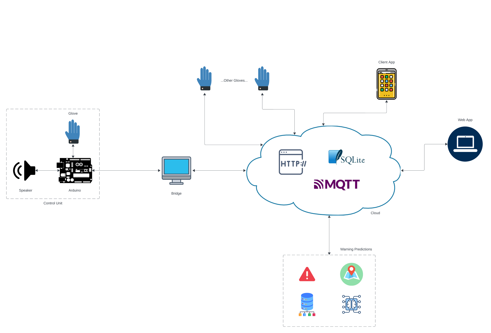
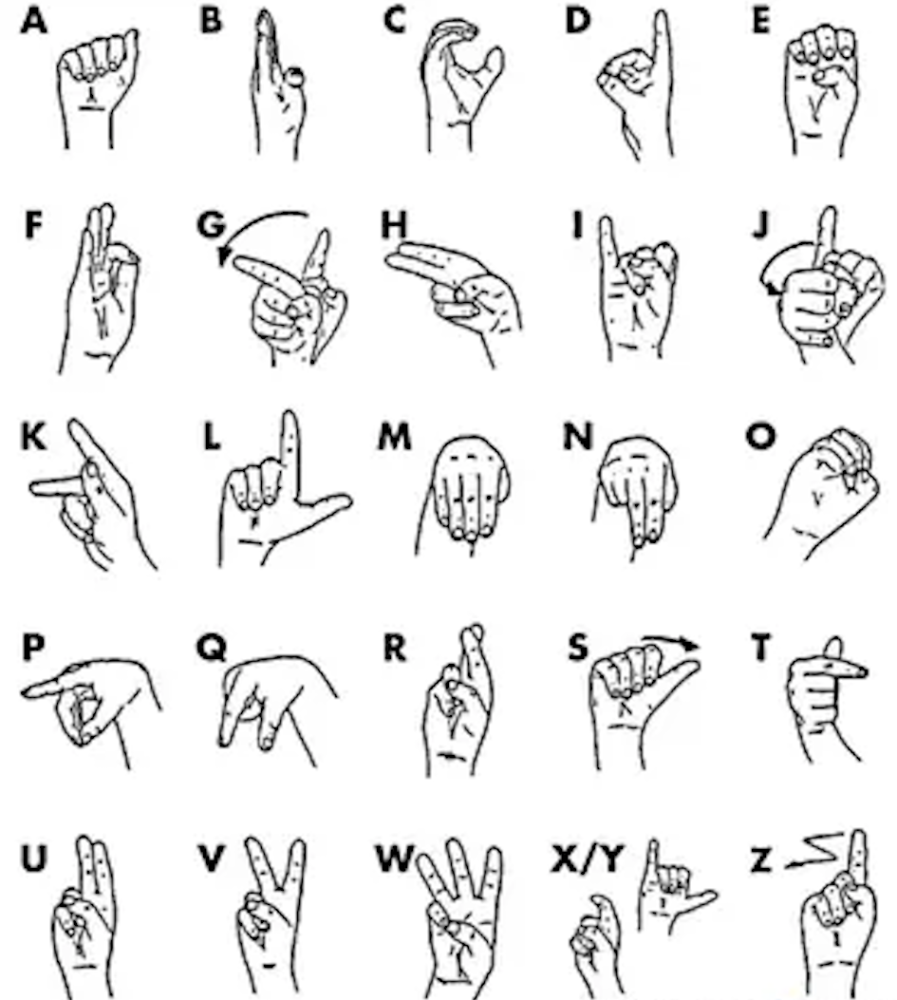
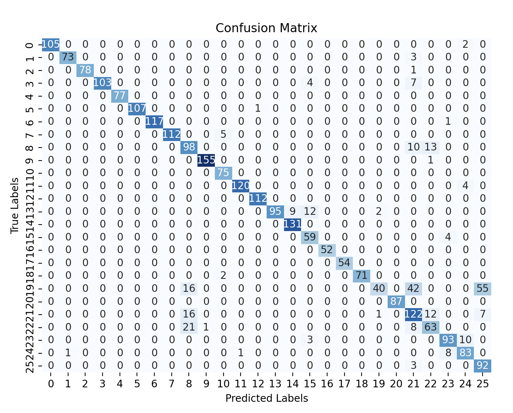
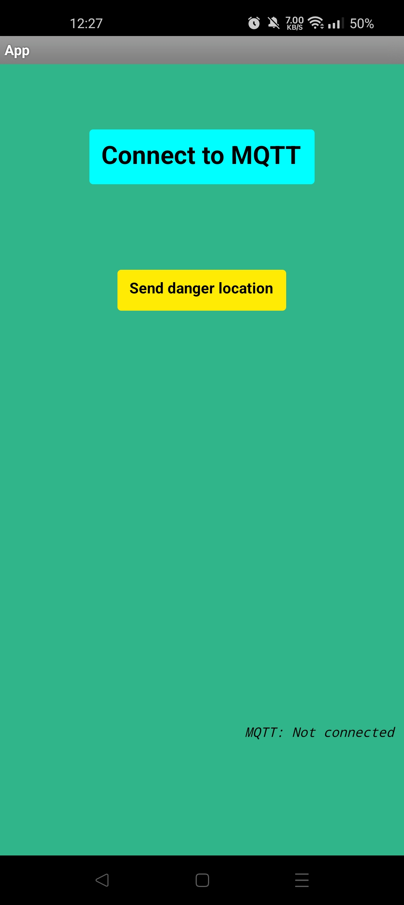
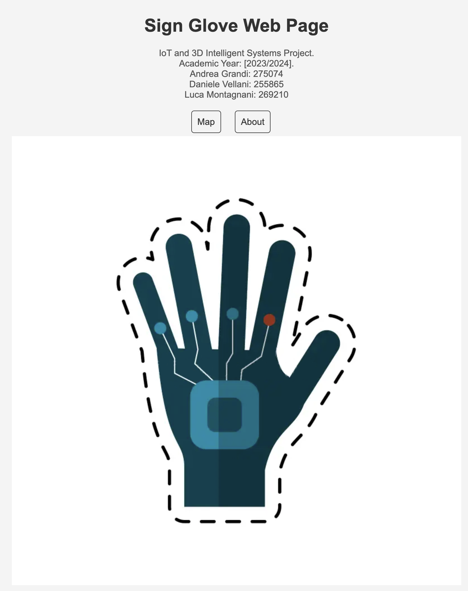
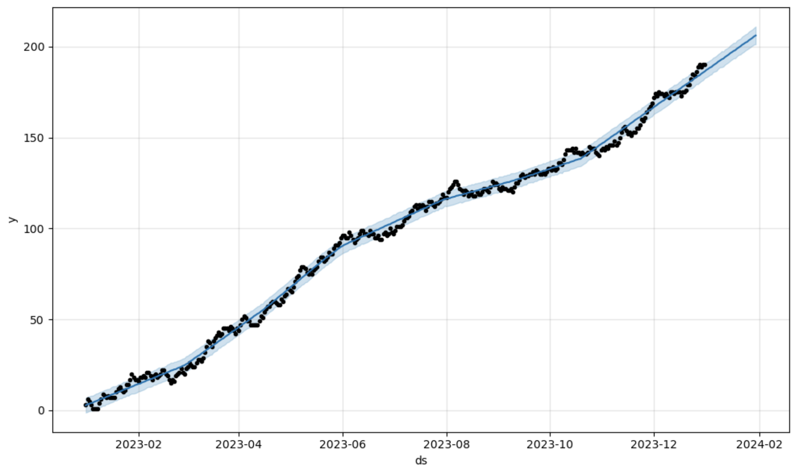
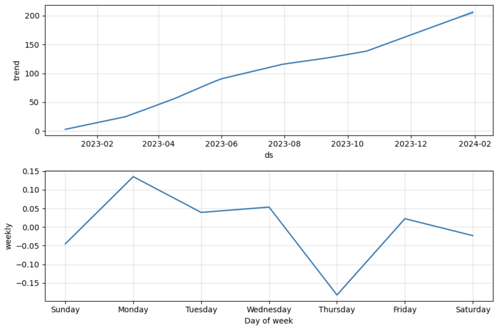

# Sign Gloves

_IoT and 3D Intelligent Systems project 2023/2024_

**Sign Glove** is a system that convert sign language in audio for interactions between deaf people and non-deaf people. Through the use of sensors (flex sensors, microphone, GPS, etc.), it is able to translate sign language. Additionally, it can detect potentially hazardous situations in the environment (such as ambulance sounds, loud noises, or signals of distress) and alert others through the gloves.

## Structure

- Controller: Arduino/Esp32 - C++
- Android App: MIT App Inventor
- Web App: Flask - Python
- Prediction: Prophet
- Comunications: HTTP/MQTT
- Database: SQLite/CouchDB

## Control Unit

The control unit manages the sensor and actuator components of the glove. The control unit is also responsible for bridging between Arduino and the cloud.

---

#### Lis Sign Language

Example of hand positions for lis sign language:

---

#### Results

For the control unit part, we have achieved a fairly high accuracy. This allows the glove to translate with high precision

## Android App

The smartphone client manages the display of hazard messages in the area. Through a registration interface, we can add new gloves.

Main screen:

Login screen:

## Web App

The Web App is the centre of this system. The backend part manages the database and all the requests, while in the frontend is possible to manage ones dispositives.

## Predictions

This system is capable of predicting hazardous situations and time series with Prophet.

These graphs are just examples. The data in question refer to a single neighborhood in Modena and indicate the quantity of warnings for each day.

## Credits

- Andrea Grandi: [@andrea-grandi](https://github.com/andrea-grandi)
- Luca Montagnani: [@montaoo](https://github.com/montaooo)
- Daniele Vellani: [@franzione1](https://github.com/franzione1)
